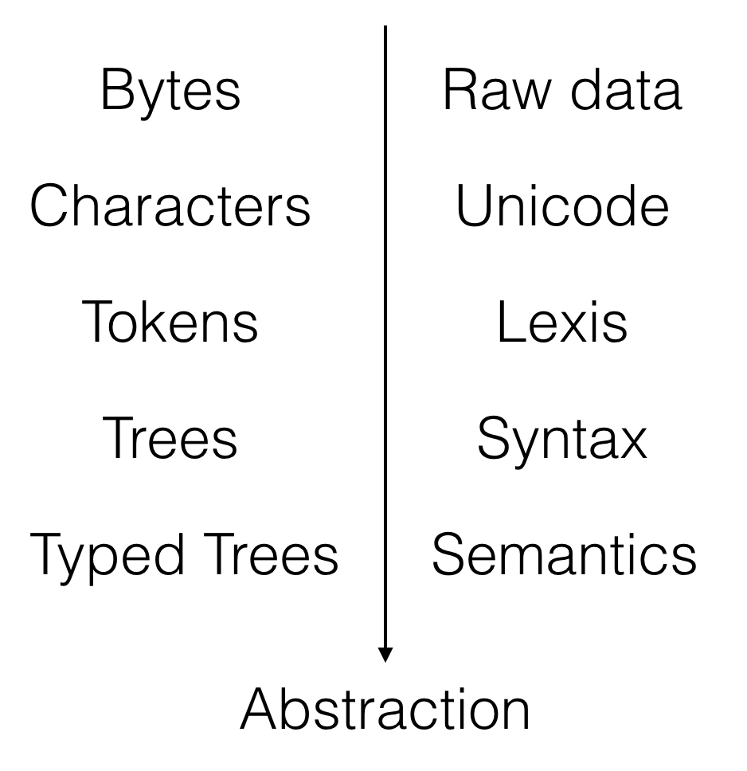
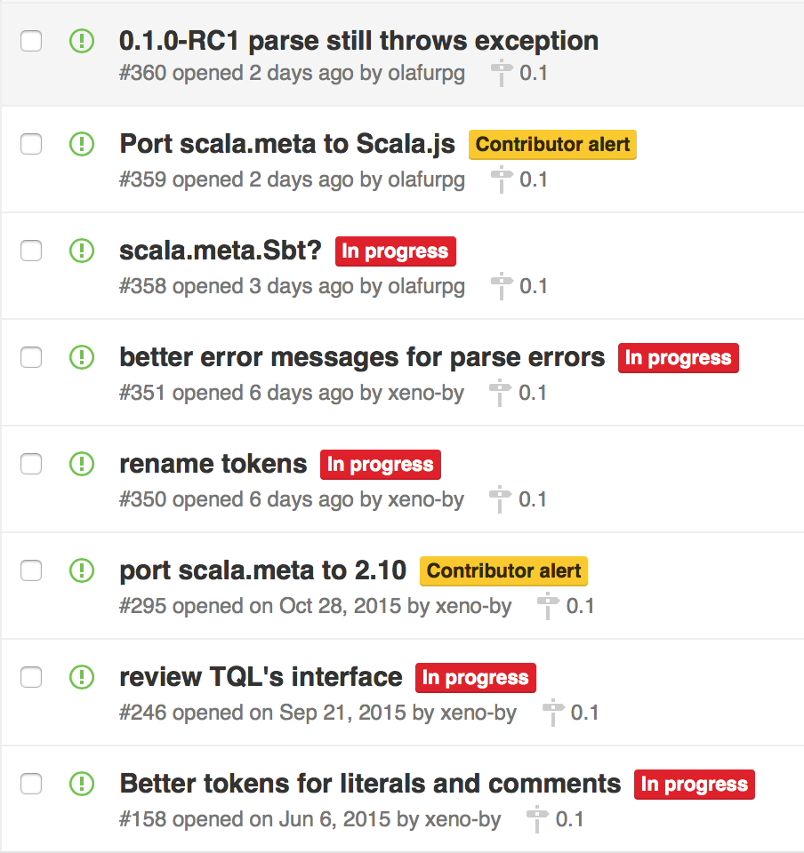

# Data as code and code as data

Denys Shabalin, LAMP/EPFL

---

# <strike>Data as code and</strike> code as data

Denys Shabalin, LAMP/EPFL

---

# About me

* Born in Ukraine
* Implemented [quasiquotes for 2.11]()
* Co-authored [scala.meta]() (with Eugene Burmako)
* Created [scala-offheap]()

---

# Today

1. Where does the idea comes from?
1. What about Scala?
1. What are the use cases?

---

# Not about

* Macros
* Reflection
* Language design

---

# 1. The origin

---


<p style="color: grey;font-size:14pt;">
(Image by Conrad Barski, M.D.)
</p>

---

# S-expressions

* Atoms:
    * Numbers: 1, 2.0, ...
    * Strings: "Hello, world!"
    * Symbols: lambda, +, -, =
    * ...
* Lists:
    * (a b c)
    * [a b c]
    * ...

---

# Lisp

Code is expressed through s-expressions:

```
> (define factorial
    (lambda (n)
      (if (= n 0)
          1
          (* n (factorial (- n 1))))))

> (factorial 10)
3628800
```

---

## Quasiquotes

```
> (quasiquote (factorial 10))
'(factorial 10)

> (let*
    ([fact10 (quasiquote (factorial 10))])
    (eval fact10))
3628800

> (let*
    ([n      (quasiquote 10)]
     [fact10 (quasiquote (factorial (unquote n)])
    fact10)
'(factorial 10)
```

---

# 2. Scala? .meta!

---

## .meta

https://github.com/scalameta/scalameta

"This project is a clean-room implementation of a metaprogramming toolkit for Scala, designed to be simple, robust and portable."

---

## .meta layers



---

## .meta tokens

---

## .meta concrete syntax

---

## .meta quasiquotes

---

## .meta semantics


---

## .meta 0.1



---

# 3. Use cases

---

## scalafmt

Based on .meta, heavily uses tokens and concrete syntax.

http://olafurpg.github.io/scalafmt/

---

## Codacy

https://www.codacy.com

"Get static analysis, code coverage, duplication and complexity information on each change to automate your code reviews."

---

## TL;DR

.meta makes viewing code as data easy and fun.

---

## Questions?

Follow us on twitter for updates:

Eugene Burmako [@xeno-by](https://github.com/xeno-by)

Denys Shabalin [@densh](https://github.com/densh)
