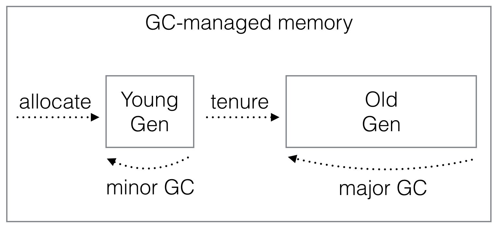
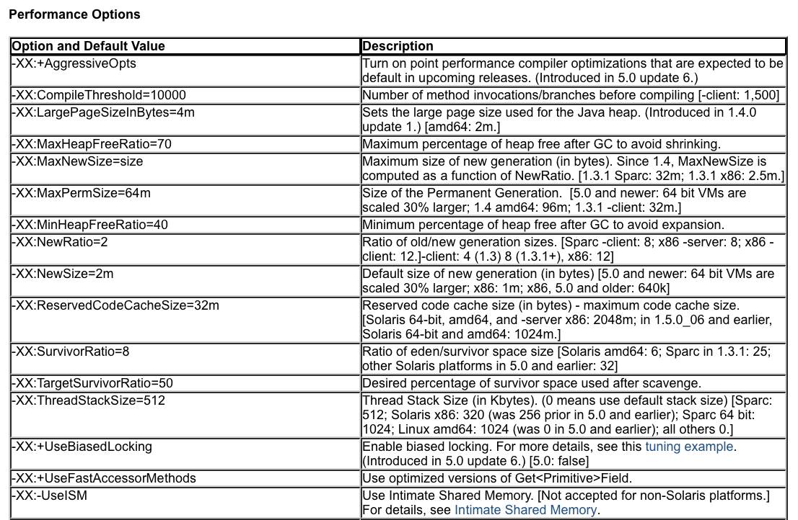
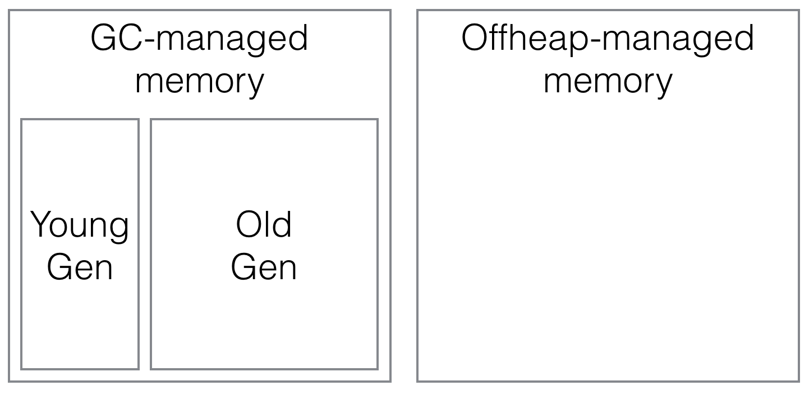

# Pauseless Scala with scala-offheap

Denys Shabalin, LAMP/EPFL

[@den_sh](http://twitter.com/den_sh)

---

## About me

* Born in Ukraine
* Research assistant at EPFL

---

* Author of [quasiquotes in 2.11](http://docs.scala-lang.org/overviews/quasiquotes/intro.html)


* Co-author of [scala.meta](https://github.com/scalameta/scalameta)


* Author of [scala-offheap](https://github.com/densh/scala-offheap)


---

## About me

Personal goal: exposing lower-level APIs in Scala
to make writing predictable performance-sensitive code easy.

---

# Today

1. Generational GCs overview
1. Avoiding garbage
1. Using off-heap memory

---

## Generational Hypothesis

"Most object die young."

---

## Generational GC



<span style="color: grey; font-size: 16pt">
(Grossly oversimplified illustration.)
</span>

---

## Sources of garbage

1. Closures
1. Boxing
1. Implicit decorators
1. Varargs
1. Actual allocations

---

## Puzzle #1

```scala
val arr = Array.fill(100500)(99)

arr.map(_ + 1).map(_ * 3)
```

---

## Puzzle #2

```scala
val arr = Array.fill(100500)(999999)

arr.map(_ + 1).map(_ * 3)
```

---

## Puzzle #3

```scala
val arr = List.fill(100500)(999999)

arr.map(_ + 1).map(_ * 3)
```

---

## Measure, don't guess

* guessing is hard in the presence of optimising compilers.

* `jvisualvm` is a reasonable built-in tool

* plenty of (better) third-party alternatives

---

## Sources of garbage

1. <strike>Closures</strike>
1. <strike>Boxing</strike>
1. <strike>Implicit decorators</strike>
1. <strike>Varargs</strike>
1. Actual allocations

---

## Tuning VM flags



<span style="color: grey; font-size: 16pt">
(Only a fraction of [vm flags](http://www.oracle.com/technetwork/articles/java/vmoptions-jsp-140102.html) is shown here.)
</span>

---

## Tuning VM flags


---

## Tunning VM flags

* Requires understanding of VM internals

* Different GC implementations respond to them differently

* Brittle to changes as application evolves

---

# scala-offheap

https://github.com/densh/scala-offheap

---

## Offheap memory



---

## Offheap allocations

* `@data` class isntances
* `@variant` class instances
* `Array[T]`

---

## Offheap allocators

* `malloc`
* `Region { implicit r => ... }`

---

## Puzzle #4

```scala
import scala.offheap._

implicit val props =
  Region.Props(Pool(...))

Region { implicit r =>
  val arr = Array.fill(100500)(999999)

  arr.map(_ + 1).map(_ * 3)
}
```

---

## Sources of garbage

1. <strike>Closures</strike>
1. <strike>Boxing</strike>
1. <strike>Implicit decorators</strike>
1. <strike>Varargs</strike>
1. <strike>Actual allocations</strike>

---

## No garbage, no pauses


<span style="color: grey; font-size: 16pt">
(Image courtesy of [B. Dehler](http://blog.oregonlive.com/my-beaverton/2011/10/christians_and_atheists_discus.html))
</span>

---

## Summary

* Don't allocate garbage in performance-sensitives code.

* Measure, don't guess, you're probably wrong.

* Allocate domain-specific objects offheap.

---

# Questions?
