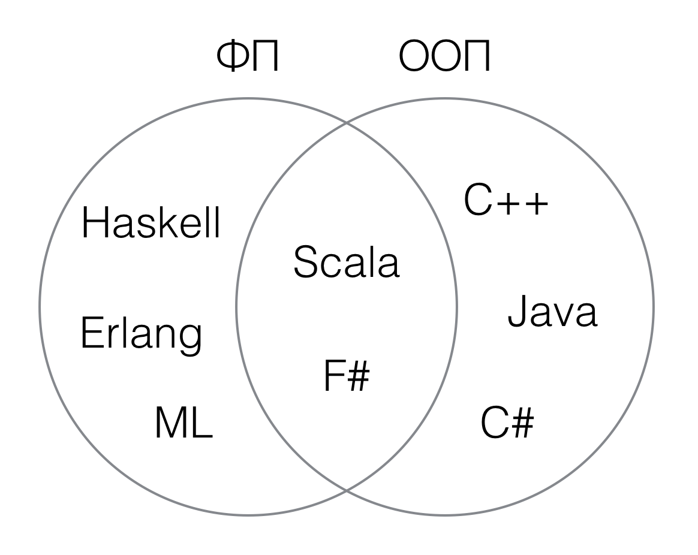

## Функциональное программирование на Scala

Шабалин Денис, LAMP/EPFL

---

## Обо мне

* Закончил ЛИТ в 2008
* Бакалавр НаУКМА в 2012
* Магистр EPFL в 2014
* На данный момент аспирант (PhD student) в EPFL

---

## Обо мне

Пять лет занимаюсь исследованиями вокруг языка программирования Scala.


---

## Сегодня

* Что такое функциональное программирование?

* Что такое Scala и для чего её используют?

---

## Парадигмы

1. Структурное программирование
2. Объектно-ориентированное программирование (ООП)
3. Функциональное программирование (ФП)

---

## Языки



---

## ООП

* Инкапсуляция
* Наследование
* Полиморфизм

---

## ФП

* Неизменяемые структуры данных
* Строгая типизация с выводом типов
* Сопоставление c образцом
* Функции высших порядков и рекурсия

---

### Неизменяемые структуры данных

```scala
scala> abstract class List[+T]
     | case class Cons[T](head: T, tail: List[T]) extends List[T]
     | case object Nil extends List[Nothing]

scala> val lst = Cons(1, Cons(2, Cons(3, Cons(4, Nil))))
lst: Cons[Int] = Cons(1,Cons(2,Cons(3,Cons(4,Nil))))

```

---

### Сопоставление с образцом

```scala
scala> def count(lst: List[Int]): Int =
     |   lst match {
     |     case Nil              => 0
     |     case Cons(head, tail) => 1 + count(tail)
     |   }

scala> count(lst)
res1: Int = 4
```

---

### Функции высших порядков

```scala
scala> def filter[A](lst: List[A])(f: A => Boolean): List[A] =
     |   lst match {
     |     case Nil =>
     |       Nil
     |     case Cons(head, tail) if f(head) =>
     |       Cons(head, filter(tail)(f))
     |     case Cons(_, tail) =>
     |       filter(tail)(f)
     |   }

scala> filter(lst)(x => x % 2 == 0)
res5: List[String] = Cons(2,Cons(4,Nil))
```

---

## Вопрос: Зачем это все?

Ответ: Распределенные системы.

---

## Распределенные системы


---

## Spark

Простой код и автоматическое распределение:

```scala
scala> val textFile = sc.textFile("huge-file.txt")
textFile: spark.RDD[String] = spark.MappedRDD@2ee9b6e3

scala> textFile.filter(line => line.contains("Spark")).count()
res3: Long = 15
```

---

## Сводка

* ФП — это модная парадигма программирования

* Scala — это гибридный ФП-ООП язык

* ФП хорошо ложится на распределенные системы

---

## Вопросы?
