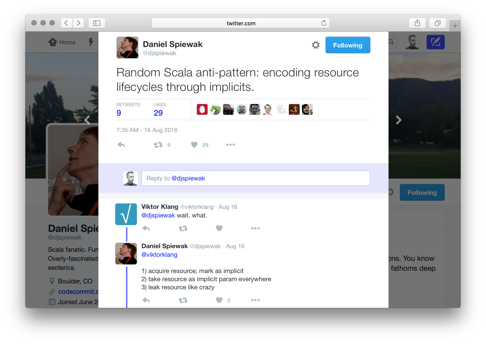

<!--
* Wiki: System Resource
  https://en.wikipedia.org/wiki/System_resource
* Wiki: Resource Management
  https://en.wikipedia.org/wiki/Resource_management_(computing)
* Wiki: RAII
  https://en.wikipedia.org/wiki/Resource_Acquisition_Is_Initialization
* Wiki: Object Lifetime
  https://en.wikipedia.org/wiki/Object_lifetime
* MSDN: Object Lifetime And Resource Management
  https://msdn.microsoft.com/en-us/library/hh438473.aspx
* Exception safety in D
  https://dlang.org/exception-safe.html
* Change the way you write exception-safe code forever
  http://www.drdobbs.com/cpp/generic-change-the-way-you-write-excepti/184403758
* Go's defer specification
  https://golang.org/ref/spec#Defer_statements
* Python's with specification
  https://www.python.org/dev/peps/pep-0343/
* Deinitialization in Swift
  https://developer.apple.com/library/ios/documentation/Swift/Conceptual/Swift_Programming_Language/Deinitialization.html
* Using in C#
  https://msdn.microsoft.com/en-us//library/yh598w02.aspx
* Try with resources in Java
  https://docs.oracle.com/javase/tutorial/essential/exceptions/tryResourceClose.html
* Resource Management in Haskell
  http://aherrmann.github.io/programming/2016/01/04/resource-management-in-haskell/
* Haskell Managed Monad
  https://hackage.haskell.org/package/managed-1.0.5/docs/Control-Monad-Managed.html
* Scala ARM:
  https://github.com/jsuereth/scala-arm
-->

# Managing Your Resources

Denys Shabalin, LAMP/EPFL

[@den_sh](http://twitter.com/den_sh)

---

Alternative talk title:

# Try-finally considered harmful

---

## Everybody gets it wrong

It's hard to impossible to write exception safe code.

---

## Few people get it right

Akka's actor cell cleanup:

```scala
  private def finishTerminate() {
    val a = actor
    /* The following order is crucial for things to work properly.
     * Only change this if you're very confident and lucky.
     */
    try if (a ne null) a.aroundPostStop()
    catch handleNonFatalOrInterruptedException { ... }
    finally try dispatcher.detach(this)
    finally try parent.sendSystemMessage(...)
    finally try stopFunctionRefs()
    finally try tellWatchersWeDied()
    finally try unwatchWatchedActors(a)
    finally {
      ...
    }
  }
```

---

## What's a resource?

An entity that you can:

* Acquire: get an instance of a resource
* Release: dispose of the used up resource

Time between the two = resource lifetime.

---

## Resources in the wild

* File handles
* Network connections
* Locks
* Off-heap memory allocations
* Thread pools
* Actor systems
* OpenGL Contexts
* ...

---

## Common theme

Resources are heavy.

You don't want to lose them.

You do want to release them ASAP.

---

# Things People Do

* Manage it manually
* RAII (Resource Acquisition Is Initialization)
* Scope guards
* Using statement
* Monads

---

## Manual Management

As seen in: every single language.

---

## Manual Management: C

The only language where it's OK to manage things manually.

```C
int main() {
  FILE* f = fopen("file.txt", "w");   Λ
                                      |
  // Do some work here                |  lifetime of f
                                      |
  fclose(f);                          V
  return 0;
}
```

---

## Manual Management: Java

Standard resource handling before Java SE 7:

```Java
public class MyApp {
  public static void main(String[] args) {
    PrintWriter f = new PrintWriter("file.txt")   Λ
    try {                                         |
                                                  |
      // Do some work here                        | f
                                                  |
    } finally {                                   |
      f.close()                                   V
    }
  }
}
```

---

## Resource Acquisition
## Is Initialization

As seen in: C++, D, Rust, ...

---

## RAII: C++

```c++
class File {
public:
  File(const char *path, const char *mode) {
    _file = fopen(path, mode);
  }
  ~File() {
    fclose(_file);
  }
private:
  FILE* _file;
}
```

Constructor Acquires, Destructor Releases.

---

## RAII: C++

```C++
int main() {
  File f("file.txt", "r");   Λ
                             | f
  // Do some work here       |
                             |
  return 0;                  |
}                            V
```

Cleanup is done for you automatically.

---

## Scope guards

As seen in: C++, D, Go

---

## Scope guards: defer in Go

```Go
func main() {
  f, _ := os.OpenFile("file.txt", os.O_WRONLY, 0644)   Λ
  defer f.close()                                      |
                                                       | f
  // Do some work here                                 |
}                                                      V
```

---

## Using

As seen in: C#, Python, Java, Haskell, ...

---

## Using: Try with resources

Modern Java:

```Java
public class MyApp {
  public static void main(String[] args) {
    try (PrintWriter f = new PrintWriter("file.txt")) {    Λ
                                                           |
      // Do some work here                                 | f
                                                           |
    }                                                      V
  }
}
```

---

## Monads

As seen in: Haskell, Scala

---

## Monads: Scala ARM

```Scala
import resource._

for (f <- managed(new PrintWriter("file.txt"))) {   Λ
                                                    |
  // Do some work here                              | f
                                                    |
}                                                   V
```

---

# Contemporary Scala

---

## What happens in practice

```
{
  val f = new PrintWriter("file.txt")))   Λ
                                          |
  // Do some work here                    | f
                                          |
}                                         ?
```

It compiles, it runs, ship it.

---



---

## Not quite

Passing resources as implicits is a bad idea.

**Implicits are the *perfect* tool to model resource lifetimes.**

---

## Unicorn solution

```Scala
{
  val f = new SafeWriter("file.txt")   Λ
                                       |
  // Do some work here                 | f
                                       |
}                                      V
```

---

## Getting real

Encoding resource lifetime through implicits:

```Scala
Scope { implicit in =>
  val f = new SafeWriter("file.txt")   Λ
                                       |
  // Do some work here                 | f
                                       |
}                                      V
```

`Scope` is a first-class lifetime passed around implicitly.

---

## Scopes = stacks of resources

Resources acquisition requires a scope.

Scopes gurantee clean up once finished.

---

## Resources require scopes

To acquire a resource one must provide a proof of clean up.

```Scala
class SafeWriter(path: String)(implicit in: Scope) {
  private val writer = acquire(new PrintWriter(path))
  def write(msg: String) = writer.write(msg)
}
```

---

## Can't Get It Wrong

Careless resource handling won't compile any longer.

```Scala
{
  val f = new SafeWriter("file.txt")

  // Do some work here
}
```

---

## We've Got Your Back

```
MyApp.scala:2: Resource acquisition requires a scope.

      val f = new SafeWriter("file.txt")
              ^
```

---

## It Gets Better In Dotty

Implicit functions let one inject implicits automatically:

```Scala
Scope {
  val f = new SafeWriter("file.txt")   Λ
                                       |
  // Do some work here                 | f
                                       |
}                                      V
```

---

# Coding it up

[gist.github.com/densh/75d2d3063571d89ee34e161b4a61c74a](https://gist.github.com/densh/75d2d3063571d89ee34e161b4a61c74a)

---

# Takeaway

---

## Get your stuff together, get it all together and put it in a back pack, all your stuff, so it's together.

---

## And if you gotta take it some where, take it somewhere, you know, take it to the stuff store and sell it, or put it in the stuff museum.

---

## I don't care what you do, you just gotta get it together.

---

## Get your stuff together.

---

# Thanks!

Follow [@den_sh](http://twitter.com/den_sh) for more.

